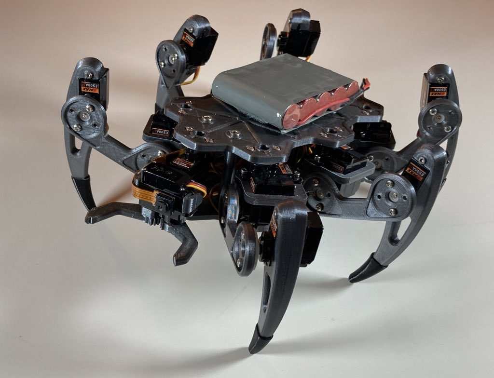
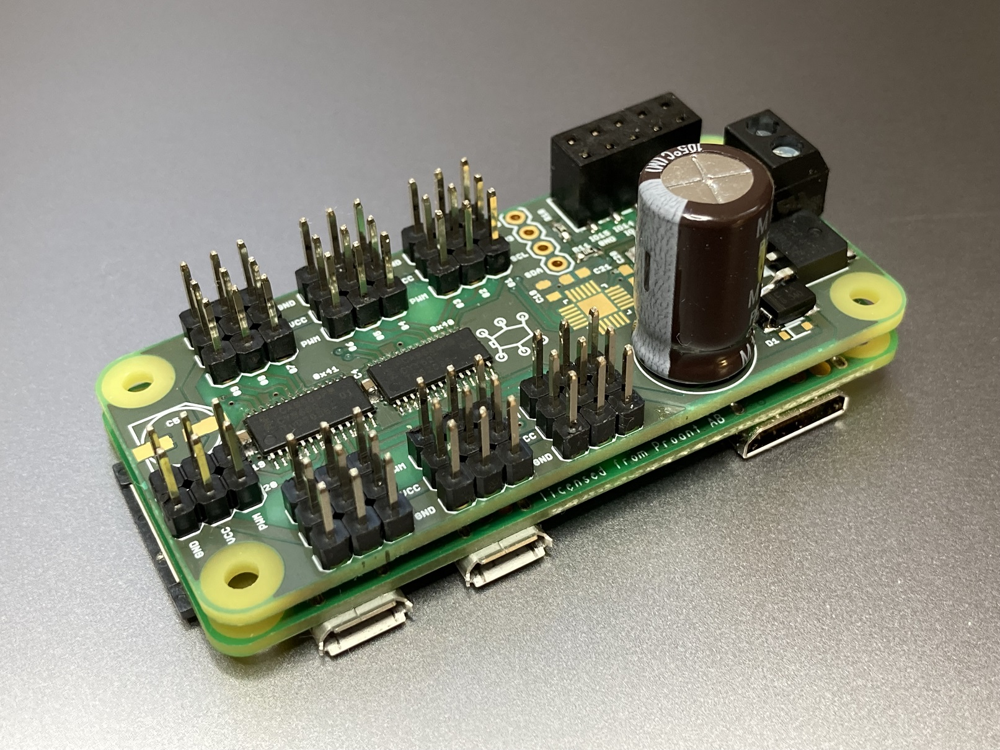

# ZeroBug Lite

Zerobug Lite is a minimalistic version of the ZeroBug Hexapod robot. By porting the microcontroller's features to Python, the robot can be fully controlled with only the Rasbperry Pi and an updated PCB.

This is a somewhat experimental build. Use at your own risk!

For CAD files, see the original project: https://github.com/CoretechR/ZeroBug

